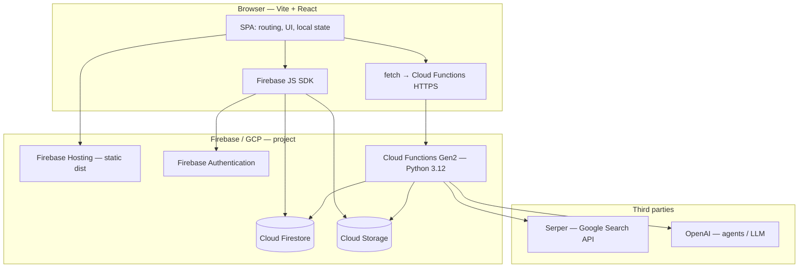
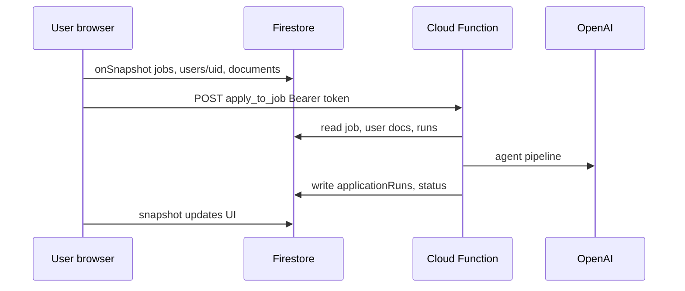

# Vibejobber

**Vibejobber** is a job-search and application assistant: users maintain a profile and preferences, browse a shared **job catalog** (Firestore), generate **tailored CVs and cover letters** with server-side LLM agents, and run an **apply pipeline** that uses those documents against live postings. The product is a **React SPA** on **Firebase Hosting** with **Firebase Auth**, **Firestore**, **Cloud Storage**, and **Firebase Cloud Functions (Python Gen2)** for search ingestion, URL import, document generation, and automated apply flows.

---

## High-level architecture

**Request paths**

- **Reads/writes** for profile, jobs, applications, and documents: **client → Firestore/Storage** with security rules enforcing user scope.
- **Heavy / privileged work** (fetch arbitrary job URLs, run agents, fill forms, Serper): **client → HTTPS Cloud Function** with **Firebase ID token** in `Authorization`, function uses **Admin SDK** and service account credentials.

---

## Repository layout

| Path | Responsibility |
|------|----------------|
| **`frontend/`** | Vite + React + TypeScript UI, Tailwind/shadcn-style components, Firebase client, real-time store. See [`frontend/README.md`](frontend/README.md). |
| **`cloud_functions/`** | Python Gen2 HTTP handlers, discovery, import, document agents, apply runner. See [`cloud_functions/README.md`](cloud_functions/README.md). |

Optional or legacy paths (e.g. monorepo `backend/` for shared Python) may exist for `import_paths` resolution in functions; the deployable function bundle is under **`cloud_functions/functions/`**.

---

## Design decisions

### 1. Firebase as the integration hub

**Decision:** Use **Auth + Firestore + Storage + Hosting + Functions** in one project instead of a separate BFF on Cloud Run or Kubernetes.

**Rationale:** Fewer moving parts for a small team, built-in auth token verification on the server, real-time listeners without operating a WebSocket layer, and Hosting CDN for the SPA.

### 2. Real-time client store (`useSyncExternalStore` + Firestore snapshots)

**Decision:** The main app state for jobs, user profile, applications, documents, and apply runs is synchronized from **Firestore `onSnapshot`**, not from REST APIs or React Query for those domains.

**Rationale:** Single source of truth, instant cross-tab updates, and straightforward handling when Cloud Functions write server-side fields (runs, statuses) that the UI must reflect.

### 3. Split “data plane” vs “compute plane”

**Decision:** CRUD that rules can express stays on the **client**; **Functions** own Serper calls, outbound HTTP to job boards, long agent runs, and PDF/form automation.

**Rationale:** Keeps secrets off the client, avoids CORS on third-party career sites, and allows **long timeouts** (e.g. apply) independent of browser tab lifetime.

### 4. Canonical job IDs from posting URLs

**Decision:** Global **`jobs`** documents use a **stable id** derived from normalized apply URLs (`job_ids.py` on the server; same idea consumed by the client as document id).

**Rationale:** Dedupes the same role across discovery (Serper) and user-pasted links (`import_job_from_url`) without a separate merge job.

### 5. Gen2 HTTP functions with `invoker="public"` + in-function auth

**Decision:** Browser-callable functions are **publicly invocable** at the IAM layer; **Firebase ID tokens** are verified inside the handler.

**Rationale:** Gen2 requires unauthenticated OPTIONS for CORS preflight; pushing auth into code keeps one consistent pattern for user JWTs vs internal cron secrets (`X-Internal-Secret`).

### 6. Firestore long polling in the web client

**Decision:** `initializeFirestore` with **`experimentalForceLongPolling: true`**.

**Rationale:** Default WebChannel is often blocked by privacy extensions, which breaks listeners with opaque network errors.

---

## Trade-offs

| Area | Trade-off |
|------|-----------|
| **Firestore reads** | Global `jobs` collection subscription scales with **catalog size** — simple for MVP, but large catalogs increase client read volume and memory. Pagination or segmented queries would reduce cost. |
| **Custom store vs React Query** | The Firestore-centric store is **explicit but bespoke**; onboarding new contributors may prefer TanStack Query patterns everywhere. Query is available in the tree for incremental adoption. |
| **Serverless apply** | **Long-running** apply on Functions avoids client disconnect issues but hits **timeout**, **memory**, and **cold start** limits; very heavy workloads might need Cloud Run Jobs or a queue worker later. |
| **Public function URLs** | IAM-public endpoints rely on **correct token checks** and secret handling; misconfiguration is higher impact than IAM-only private invoke. |
| **User-supplied URL fetch** | Server-side import improves UX but requires ongoing **SSRF / abuse** hardening (host allowlists, size limits, HTML-only validation — see `import_job_url.py`). |
| **Single-region defaults** | Functions region and Firestore are typically **regional**; global users see latency to one region unless you add multi-region strategies later. |
| **Monolith functions codebase** | One Python package shares dependencies for all handlers — simpler deploy, but **larger cold-start artifact** than split micro-functions per route. |

---

## Future improvements

1. **Job catalog scale** — Server-side or paginated **job queries** (filters, cursor), optional **Algolia/Typesense** for search, or materialized views to avoid full-collection snapshots on the client.
2. **App Check** — Enable **Firebase App Check** (reCAPTCHA Enterprise / Play Integrity) to reduce abuse on callable endpoints and Firestore.
3. **CI/CD** — GitHub Actions (or similar) to **lint, test, build**, deploy Hosting and Functions on merge, with **environment-specific** `VITE_*` and secret injection.
4. **Observability** — Structured client logging (optional), **Sentry** / **Firebase Performance**, dashboards on Function latency, error budgets on `apply_to_job`.
5. **Apply pipeline resilience** — **Queue + worker** (Cloud Tasks / Pub/Sub) for apply so HTTP returns quickly and retries are explicit; today the user waits on a long HTTP response.
6. **Testing** — **Vitest** (frontend) and **pytest** (Cloud Functions) unit suites are in-repo; add **integration tests** against the Emulator Suite for rules and E2E flows.
7. **i18n & a11y** — Internationalization and deeper accessibility audits on Radix-based components.
8. **Cost controls** — Per-user LLM **budgets**, model routing by tier, caching of job excerpts where safe.
9. **Rules hardening** — Periodic **security rules** review, least-privilege Storage paths, field-level constraints where useful.

---

## Unit tests

| Part | Command | Notes |
|------|---------|--------|
| **Frontend** | `cd frontend && npm test` | **Vitest** + jsdom: `src/**/*.test.ts` (e.g. `jobsFromFirestore`, `applyAgent`, `jobImport`, `cvTextImport`, `markdownPreview`). |
| **Cloud Functions** | `cd cloud_functions && python -m pip install -r functions/requirements.txt -r functions/requirements-dev.txt && python -m pytest` | **pytest** under `cloud_functions/tests/` (job ids, Serper query builders, import-job heuristics, usage helpers, apply trace). `tests/stubs/agents` shadows conflicting top-level `agents` PyPI packages so `usage_helpers` imports stay stable. |

---

## Quick links

| Doc | Content |
|-----|---------|
| [`frontend/README.md`](frontend/README.md) | SPA stack, routing guards, Firebase client, store, env, Hosting deploy. |
| [`cloud_functions/README.md`](cloud_functions/README.md) | Python functions, endpoints, env secrets, Firestore/Storage touchpoints, deploy. |

---

## Local development (overview)

1. **Frontend:** `cd frontend && npm install && npm run dev` — configure `frontend/.env` from `.env.example`.
2. **Functions:** `cd cloud_functions` — Python venv, `pip install -r functions/requirements.txt`, use Firebase emulators or deploy a dev project.
3. Align **Firebase project id**, **Auth providers** (Google / Apple), and **rules** with the console before end-to-end testing.

---

## License / contributions

Add your license and contribution guidelines here when you open the repository publicly.
