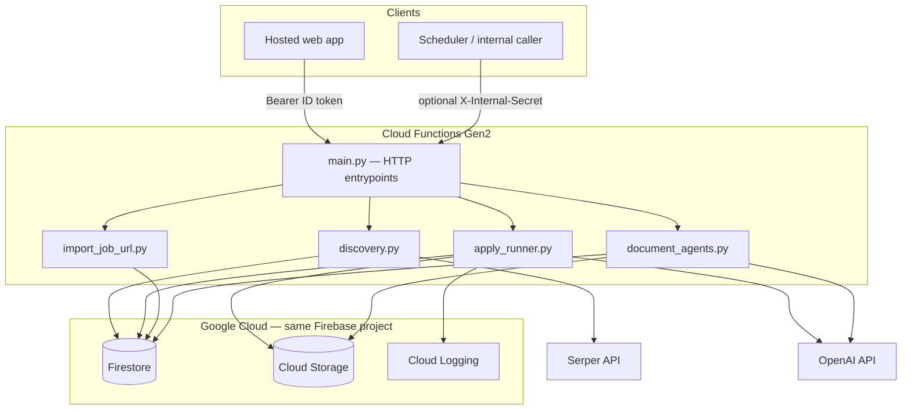

# Vibejobber — Firebase Cloud Functions (Python)

This directory deploys **Firebase Cloud Functions Gen2** (Python 3.12) that power server-side job discovery, job import from URLs, tailored document generation, and the apply pipeline. The **Firebase Admin SDK** runs with the function’s **service account** and reads/writes **Firestore** and **Cloud Storage** in the same Firebase project.

There is **no separate Cloud Run backend** in this repo path: production traffic for these features uses **HTTPS function URLs** only.

---

## Architecture at a glance



1. **HTTP layer** (`functions/main.py`): Each exported function is an `https_fn.on_request` handler. Public browser-facing endpoints use `invoker="public"` so **Firebase Auth is enforced in code** (ID token verification), not at the Google Cloud IAM layer for anonymous users.
2. **Data layer**: Handlers obtain `firestore.client()` and `storage.bucket()` after `firebase_admin.initialize_app()` (default credentials on Gen2).
3. **External APIs**: **Serper** for organic job search; **OpenAI** (via the `openai-agents` / `agents` package) for LLM-heavy flows.

---

## Repository layout

| Path | Role |
|------|------|
| `firebase.json` | Declares the Python 3.12 functions codebase (`source: functions`). |
| `.firebaserc` | Default Firebase **project id** (e.g. `vibejobber`). |
| `functions/main.py` | **Only** HTTP entrypoints: routing, auth, CORS, JSON responses. |
| `functions/import_paths.py` | Ensures `sys.path` is correct locally and in the deployed bundle. |
| `functions/discovery.py` | Aggregates search queries from Firestore users → Serper → merges into `jobs`. |
| `functions/serper.py` | Serper Google Search API client (`SERPER_API_KEY`). |
| `functions/firestore_jobs.py` | Merges Serper organic results into global `jobs` collection. |
| `functions/job_ids.py` | URL normalization and **canonical job id** (16-char hex from apply URL). |
| `functions/import_job_url.py` | Fetches a user-supplied job URL, validates HTML, extracts fields, upserts `jobs/{id}`. |
| `functions/document_agents.py` | Generates tailored CV / cover letter text (agents + Firestore + optional CV source from Storage). |
| `functions/apply_runner.py` | Full apply pipeline: load saved docs, PDFs, form-fill agent, upload artifacts, persist run. |
| `functions/apply_trace.py` | Structured **Cloud Logging** lines for apply debugging (`apply_trace …`). |
| `functions/usage_helpers.py` | Merges LLM usage from agent runs; optional USD estimate via env overrides. |
| `functions/requirements.txt` | Python dependencies (includes `firebase_functions`, `curl_cffi`, `openai-agents`, etc.). |

Supporting modules include `artifacts.py`, `pipeline.py`, `store.py`, `vibe_agents.py`, `cv_source_loader.py`, and others imported by the modules above.

---

## HTTP functions (detailed)

Gen2 URLs follow:

`https://<REGION>-<PROJECT_ID>.cloudfunctions.net/<function_name>`

Default region is typically **`us-central1`** unless you override it in Firebase/Google Cloud settings. The web app builds these URLs from `VITE_FIREBASE_PROJECT_ID` and `VITE_FIREBASE_FUNCTIONS_REGION`.

### 1. `sync_job_openings`

| | |
|---|---|
| **Purpose** | Batch **job discovery**: collect role/title-style queries from all users, call Serper (up to 10 organic hits per query), merge results into the shared **`jobs`** collection with URL-based deduplication. |
| **Decorator** | `@https_fn.on_request()` — default invoker; not marked `public` in code; secure with secret or restrict IAM in console. |
| **Auth** | If env **`INTERNAL_FUNCTION_SECRET`** is set, every request must send header **`X-Internal-Secret: <same value>`**. If unset, the check is skipped (useful only for tightly locked-down dev). |
| **Methods** | `OPTIONS` → empty `204`. Otherwise runs discovery (typically `GET`/`POST` from cron or admin tooling). |
| **Implementation** | `run_discovery_for_all_users(db)` in `discovery.py`. |
| **Firestore reads** | Streams **`users`** for `preferences.desiredRoles`, `profile.headline`, and titles from **`jobs`** linked via `applications[].jobId`. |
| **Firestore writes** | Via `merge_jobs_from_serper_organic` → upserts into **`jobs`**. |
| **External** | **`SERPER_API_KEY`** required when discovery runs real searches. |
| **Response** | JSON: `ok`, `queries_run`, `organic_merged`, `skipped_links`, `queries` (or `error`). |

### 2. `apply_to_job`

| | |
|---|---|
| **Purpose** | Run the **apply agent pipeline** for one user and one job: use saved tailored CV + cover for that job, build PDFs, run agents against the posting, upload outputs to Storage, record status on **`users/{uid}/applicationRuns/{runId}`**. |
| **Decorator** | `invoker="public"`, **`timeout_sec=3600`**, **`memory=512 MiB`** — long-running; browser preflight must succeed without Google-signed user identity. |
| **CORS** | `@cross_origin(origins="*", …)` — required so browsers do not see duplicate `Access-Control-Allow-Origin` headers (handlers use `_json()` without adding CORS headers manually). |
| **Auth (user)** | **`POST`** only. Header **`Authorization: Bearer <Firebase ID token>`**. Token is verified with **`auth.verify_id_token`**. `uid` must match the user whose documents are used. **`require_user_job_docs=True`**: pipeline requires existing tailored CV + cover in Firestore for that `jobId`. |
| **Auth (internal)** | If no Bearer token, **`X-Internal-Secret`** must match **`INTERNAL_FUNCTION_SECRET`** (when set). Body must include **`userId`** and **`jobId`**. Internal path sets **`require_user_job_docs=False`** (no pre-check that docs exist — for trusted automation). |
| **Body** | JSON: `{ "jobId": "<Firestore jobs doc id>" }` — and for internal calls, `{ "userId": "...", "jobId": "..." }`. |
| **Implementation** | `run_apply_pipeline` in `apply_runner.py` (OpenAI Agents `Runner`, temp files, GCS uploads, status history). |
| **Logging** | On success, **`apply_trace`** logs `http_apply_response_ok` with run metadata for Cloud Logging filters. |
| **Response** | JSON: `ok`, `runId`, artifact URIs, **`internalLlm`** usage summary, etc., or `error`. |

**Environment (apply path)**

| Variable | Meaning |
|----------|---------|
| `VIBJOBBER_AGENT_STEP_TIMEOUT_SEC` | Per-step agent timeout (default `300`). |
| `VIBJOBBER_AGENT_MODEL` | Model name passed into agent runs (default `gpt-4o-mini`). |
| `OPENAI_API_KEY` | Required in practice for OpenAI — set as a **secret** in Firebase/Cloud Functions (not committed). |

### 3. `import_job_from_url`

| | |
|---|---|
| **Purpose** | **User-initiated job import**: given a public **job posting URL**, the server fetches HTML (browser-like TLS via **`curl_cffi`** when possible), checks the page looks like a single job posting, extracts structured text (JSON-LD `JobPosting`, main content, section heuristics), and **creates or skips** **`jobs/{canonical_job_id}`** (same id scheme as discovery). |
| **Decorator** | `invoker="public"`, `timeout_sec=60`, `memory=512 MiB`. |
| **Auth** | **`Authorization: Bearer <Firebase ID token>`** required (token verified; no anonymous import). |
| **Body** | JSON: `{ "url": "https://..." }`. |
| **Implementation** | `import_job_from_user_url(db, url)` in `import_job_url.py` (DNS/host allowlists, redirect checks, `assert_page_looks_like_job_posting`, `build_imported_job_fields`, `_build_job_doc`). |
| **Firestore** | Read **`jobs/{id}`** for existence; if missing, **`set(..., merge=True)`** new job doc with `source: "user_link"`. |
| **Response** | JSON: `ok`, `jobId`, `existing` (boolean), or `error` (e.g. validation, 403 fetch, “not a job page”). |

**Notable behavior in `import_job_url.py`**

- **Fetch**: Prefer **`curl_cffi`** with Chrome impersonation; warm-up requests to same-origin `/`, `/careers/`, etc.; fallback to **`requests`** session.
- **Safety**: Denylist hosts, URL heuristics, visible-text phrase scores, JSON-LD / `og:type` checks to reject non-job pages.
- **Dedupe**: `canonical_job_id(normalize_apply_url(final_url))` so the same posting URL always maps to the same document id.

### 4. `generate_job_document`

| | |
|---|---|
| **Purpose** | **Server-side generation** of a tailored **CV** or **cover letter** for a job using **`openai-agents`**, reading the user profile, job record, and optional source CV from Storage. |
| **Decorator** | `invoker="public"`, **`timeout_sec=600`**, `memory=512 MiB`. |
| **Auth** | Bearer **Firebase ID token**; **`uid`** required. |
| **Body** | JSON: `{ "jobId": "<jobs doc id>", "kind": "cv" \| "cover_letter" }`. |
| **Implementation** | `run_generate_job_document_sync` in `document_agents.py` (async agent runs, merged usage). |
| **Firestore / Storage** | **Reads** `users/{uid}` (profile, optional `sourceCvStoragePath`) and **`jobs/{jobId}`**. Loads source CV text from **Storage** when a path is present (`cv_source_loader`). **Does not** write documents to Firestore itself — the **client** saves the returned `content` into `users/{uid}/documents` as in your app flow. |
| **Response** | JSON: `ok`, `content`, `title`, **`internalLlm`** (tokens / cost helpers), or `error`. |

**Environment (document agents)**

| Variable | Meaning |
|----------|---------|
| `VIBJOBBER_AGENT_MODEL` | Override model (see `config.py` / `document_agents.py`). |
| `VIBJOBBER_DOC_AGENT_TIMEOUT_SEC` | Agent run timeout (default `300`). |
| `VIBJOBBER_PRICE_IN_PER_TOKEN` / `VIBJOBBER_PRICE_OUT_PER_TOKEN` | Optional overrides for **usage_helpers** USD estimates. |

---

## Firestore and Storage (conceptual)

- **`jobs`**: Global catalog; document id = **canonical job id** from posting URL where applicable. Discovery merges Serper fields; import merges user-link fields.
- **`users`**: Profiles, preferences, applications, nested **`documents`** (tailored CV / cover text), **`applicationRuns`** (apply pipeline status and artifacts metadata).

Exact field names are defined by your app and by merge logic in `firestore_jobs.py`, `apply_runner.py`, and `import_job_url.py`.

---

## Environment variables and secrets

Set these in **Firebase Console → Functions → configuration** or via **`firebase functions:secrets:set`** / **`gcloud`** as appropriate for Gen2.

| Name | Used by | Notes |
|------|---------|--------|
| `SERPER_API_KEY` | `serper.py` | **Required** for `sync_job_openings` when running real searches. |
| `OPENAI_API_KEY` | OpenAI / `agents` | **Required** for LLM features (`apply_to_job`, `generate_job_document`). |
| `INTERNAL_FUNCTION_SECRET` | `main.py` | Protects `sync_job_openings` and internal `apply_to_job` when set. |
| `VIBJOBBER_AGENT_MODEL` | `apply_runner.py`, `document_agents.py`, `config.py` | Default `gpt-4o-mini` if unset. |
| `VIBJOBBER_AGENT_STEP_TIMEOUT_SEC` | `apply_runner.py` | Default `300`. |
| `VIBJOBBER_DOC_AGENT_TIMEOUT_SEC` | `document_agents.py` | Default `300`. |
| `VIBJOBBER_PRICE_IN_PER_TOKEN` / `VIBJOBBER_PRICE_OUT_PER_TOKEN` | `usage_helpers.py` | Optional pricing for internal cost estimates. |
| `OUTPUT_DIR` | `config.py` | Temp/output path override (mostly local / advanced). |

Never commit secrets; use `.env` only for local emulation and keep it out of git.

---

## Deploy

Deployments use the Firebase CLI against the project in **`.firebaserc`** (default: **`vibejobber`**) and the Python 3.12 app under **`functions/`** (`firebase.json` → `source: "functions"`, `runtime: "python312"`). The build uploads that directory and runs **`pip install -r functions/requirements.txt`** on Google’s build workers.

### Prerequisites

- **Node.js** (for the Firebase CLI — global install or `npx`; CI uses `npx firebase-tools@latest`).
- A Google account with permission to deploy to the Firebase / GCP project.
- **First-time / local:** `firebase login` and ensure the right project: `firebase use` (optional; defaults match `.firebaserc`).

### Local deploy (from your machine)

Always run commands from the **`cloud_functions/`** directory (the folder that contains `firebase.json` and `functions/`).

```bash
cd cloud_functions

# Match CI: use a current Firebase CLI without a global install
npx --yes firebase-tools@latest deploy --only functions --project vibejobber --non-interactive

# Or, with firebase-tools installed globally: npm i -g firebase-tools
# firebase deploy --only functions --project vibejobber
```

Useful options:

- **All functions in this repo:** `--only functions` (default codebase `default` in `firebase.json`).
- **One function (faster when you only changed that handler):** pass the export name, e.g. `apply_to_job`:
  `npx --yes firebase-tools@latest deploy --only functions:apply_to_job --project vibejobber --non-interactive`
- If your default project in `.firebaserc` is already `vibejobber`, you can omit `--project vibejobber`.

After changing Python dependencies, redeploy so the Cloud Build step reinstalls from **`functions/requirements.txt`**.

**Runtime configuration** (API keys, timeouts, `INTERNAL_FUNCTION_SECRET`, etc.) is **not** baked into the deploy command: set or rotate those in [Firebase console → Functions → your function → environment / secrets](https://console.firebase.google.com/) (or `firebase functions:secrets:set` for Gen2 secrets) so production matches the tables in this README.

### CI (GitHub Actions)

The workflow **`.github/workflows/deploy-main-cf.yml`** runs on pushes to **`main_cf`** (and **workflow dispatch**). It:

1. Creates a **`cloud_functions/venv`**, installs **`functions/requirements.txt`** + **`functions/requirements-dev.txt`**, and runs **`pytest`**.
2. Deploys with **`FIREBASE_TOKEN`**: `npx firebase-tools@latest deploy --only functions --project vibejobber --non-interactive`.

To enable deploys, add **`FIREBASE_TOKEN`** to the environment used by the workflow (see the workflow’s “Check FIREBASE_TOKEN” step). Create a token locally with:

```bash
npx --yes firebase-tools@latest login:ci
```

Paste the printed token into the repository or environment **secrets** (never commit it to git).

---

## Local development (optional)

1. Create a virtualenv under `cloud_functions/` (or `functions/`) and install deps:  
   `pip install -r functions/requirements.txt`  
   (run from the **`cloud_functions`** directory so the path resolves.)
2. Use **Firebase emulators** if you want HTTP parity without deploying (`firebase emulators:start` — requires emulator config in `firebase.json` if not already present).
3. For quick Python checks, run with `PYTHONPATH=functions` from the repo; some paths expect **`import_paths.setup()`** as in `main.py`.

## Unit tests (pytest)

- **Install:** `pip install -r functions/requirements.txt -r functions/requirements-dev.txt` from `cloud_functions/`.
- **Run:** `python -m pytest` (see `pytest.ini` — `testpaths = tests`).
- **Layout:** `tests/conftest.py` prepends `tests/stubs` to `sys.path` **first** so a minimal **`agents` stub** (for `openai-agents`–compatible `Usage` / `RunResult`) wins over any other top-level `agents` package in your environment; then it adds `functions/` and calls `import_paths.setup()`.
- **Suites:** `test_job_ids.py` (URL normalization, canonical ids, tags), `test_import_job_url.py` (HTML validation and `build_imported_job_fields` without network), `test_import_job_url_more.py` (section scoring, hostname/URL heuristics, org/location/employment maps, merge helpers), `test_serper.py` (`short_job_id`, `build_job_search_query`), `test_apply_trace.py` (structured log line), `test_usage_helpers.py` (usage merge, cost, internal dicts).
- **Coverage (optional):** `python -m pytest --cov=functions --cov-report=term-missing` (paths may need tuning for the flat `functions` package).

---

## Observability

- **Cloud Logging**: Search for logger names such as `vibjobber.apply.http`, `vibjobber.import_job.http`, `vibjobber.documents.http`, or filter **`apply_trace`** lines by `runId=`.
- **Errors**: Uncaught exceptions in handlers return **500** with a JSON `error` message where the handler catches broadly; check logs for stack traces.

---

## Security checklist

1. **Treat function URLs as public** where `invoker="public"` is set; **always** verify Firebase ID tokens for user-facing actions (`import_job_from_url`, `generate_job_document`, user `apply_to_job`).
2. Set **`INTERNAL_FUNCTION_SECRET`** in production and restrict who can call **`sync_job_openings`** and internal **`apply_to_job`**.
3. Rotate **Serper** and **OpenAI** keys if leaked; scope project IAM so only the Functions runtime service account can access secrets you attach.
4. **`import_job_from_url`** fetches arbitrary user-supplied URLs server-side — SSRF mitigations include host/IP checks and HTML-only acceptance (see `import_job_url.py`).

---

## Related frontend configuration

The web app constructs function base URLs as:

`https://<VITE_FIREBASE_FUNCTIONS_REGION>-<VITE_FIREBASE_PROJECT_ID>.cloudfunctions.net`

See `frontend/src/lib/applyAgent.ts`, `jobImport.ts`, and `documentAgent.ts`. Keep **region** and **project id** aligned with where these functions are deployed.
